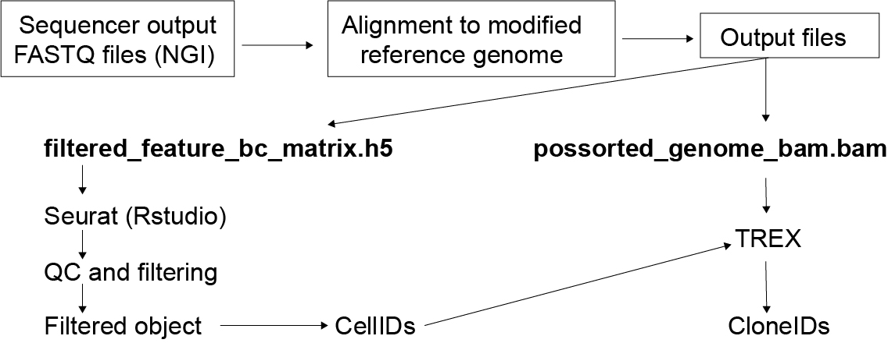

# He_et_al_Lineage_tracing

Repository for He et al. manuscript on *in utero* next generation single-cell lineage tracing used in De Haan & He et al., and He et el.

Contains scripts used to analyse data in the manuscript.

This repository contains instructions to

- [Generate the barcode library characterization](Barcode_library_sequencing)
- [Processing FASTQ files](cloneID_extraction)
- [Extract CellIDs from individual Seurat objects needed for CloneID extraction using the Trex algorithm](cloneID_extraction)
- [Jaccard Threshold and exclusion list parameter analysis](trex_parameter_sweep)
- [Integrate various scRNAseq datasets using SCTransform and adding cloneIDs into Seurat Objects](qc_and_clustering) (including QC and clustering)
- [Analisis and visualization as in Figures](analysis)

An overview of the workflow can be seen in the figure below.



## Running Python and Jupyter notebooks

Download and install conda (preferably from [MINIFORGE](https://github.com/conda-forge/miniforge#download)). 
Then clone this repository and install it.

```
git clone git@github.com:Emma-R-Andersson-Lab/He_et_al_Lineage_tracing.git
cd He_et_al_Lineage_tracing
conda env create -f environment.yml
```

Once it is installed, activate it and install TREX as we will need its helper functions.
Finally run jupyter lab to open the notebook and run the cells.

*Note: the `--no-deps` parameter is only needed in Windows.*

```
conda activate he_et_al
pip install git+https://github.com/frisen-lab/TREX.git --no-deps
jupyter lab
```

## Cite

```
Author list (2024). Title. Zenodo. https://doi.org/... .
```

## License

[GNU GPL 3.0](LICENSE)

## Contact

Open an issue in this repository.
